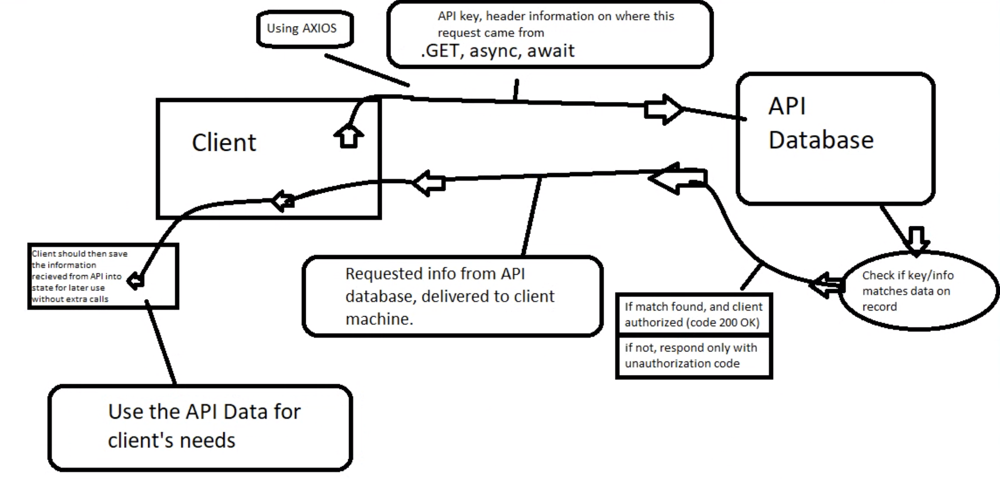

# City explorer

**Author**: Brenden Moore
**Version**: 1.0.0 (increment the patch/fix version number if you make more commits past your first submission)

## Overview

This application is used as a detailed information hub for different citys in the US, simply search what city you want to view and the citys name, LAT and LON, and an image of the city will appear after hitting the Explore button.

## Getting Started

To build a similar application, the user must install all the necessary terminal add ons, use a text editor (such as vs code) that can import react and bootstrap.

## Architecture

In this application, we used React JS along with bootstrap and React-Bootstrap, as well as basic css styling.

## Change Log

01-25-2023, basic frame work done.
01-25-2023, City title displays appon search.
01-25-2023, functionality of LAT and LON implimented on search.
01-26-2023, functionality of map display on search.
01-26-2023, server set up.
01-28-2023, used api data in functions instead of JSON file.
01-28-2023, added functionality of movie searches within city name.
02-04-2023, deployed server to render.com.

## Credit and Collaborations

Done alongside Anthony Lopez and Yuri Hlukhyi, and used LocationIQ for API data.

